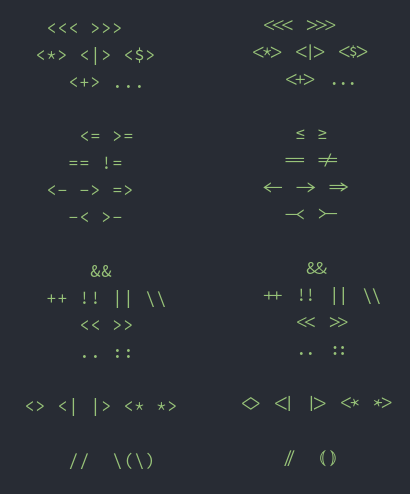

This is a fork of the [Hasklig repository](https://github.com/i-tu/Hasklig) which changes it somewhat.

The available ligatures, compared with their Source Code Pro counterparts, are:

See [HowToAddALigature.md](HowToAddALigature.md) for instructions on how to add more.

I've also added a small script `mlig.py` to hasten the book-keeping when one adds a new ligature.
