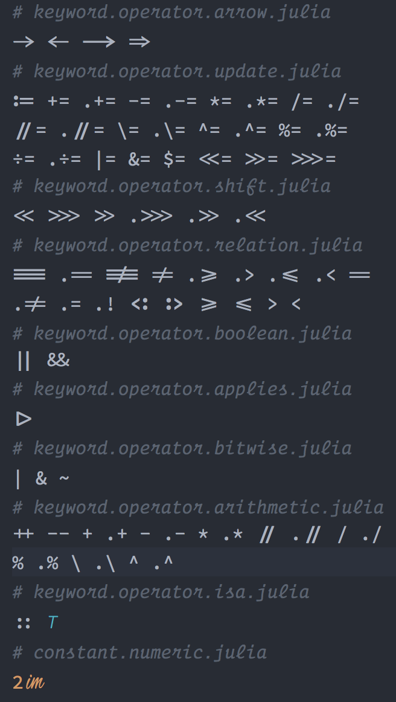

This is a fork of the [Blackfont repository](https://github.com/blackro-se/blackfont),
which is a fork of the [Hasklig repository](https://github.com/i-tu/Hasklig),  which
in turn is a fork of the [Source Code Pro](https://github.com/adobe-fonts/source-code-pro).

**Source Code Pro** doesn't support ligature right now. **Hasklig** has only limited number of
ligatures specifically for *Haskell*. I don't like some of the existing ligatures in **Blackfont**,
e.g. `≤`, `≥`, `===`, which are more like unicodes than ligatures. I also want to add some of the
ligatures specifically for Julia programming language, e.g. `<:`, `>:`, `im`. **Hasklig** has recently
changed to the *Calt* system from [Fira Code](https://github.com/tonsky/FiraCode), which has much
better editability. However, I have not figured out how to implement that. If anyone knows the
trick, please let me know.

All operators in Julia, some with ligatures, are:



See [HowToAddALigature.md](HowToAddALigature.md) for instructions on how to add more.

If you want to turn off ligatures for the current line in **Atom** editor so that editing is easier,
add the following to your *styles.less* file.

```Less
atom-text-editor .cursor-line {
  -webkit-font-feature-settings: "liga" off, "calt" off, "clig" off;
}
```
