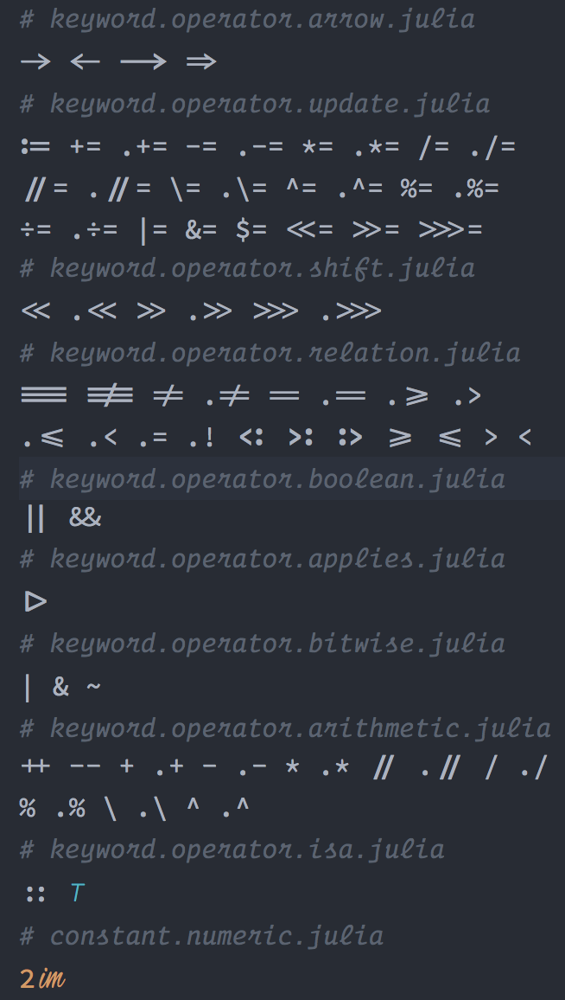

This is a fork of the [Blackfont repository](https://github.com/blackro-se/blackfont),
which is a fork of the [Hasklig repository](https://github.com/i-tu/Hasklig),  which
in turn is a fork of the [Source Code Pro](https://github.com/adobe-fonts/source-code-pro).

I don't like some of the existing ligatures, e.g. `≤`, `≥`, which are more like unicodes
than ligatures. I also want to add some of the ligatures specifically for Julia programming
language, e.g. `<:`, `>:`.

All operators in Julia, some with ligatures, are:

See [HowToAddALigature.md](HowToAddALigature.md) for instructions on how to add more.

If you want to turn off ligatures for the current line in **Atom** editor so that editing is easier,
add the following to your *styles.less* file.

`atom-text-editor .cursor-line {
  -webkit-font-feature-settings: "liga" off, "calt" off, "clig" off;
}`
